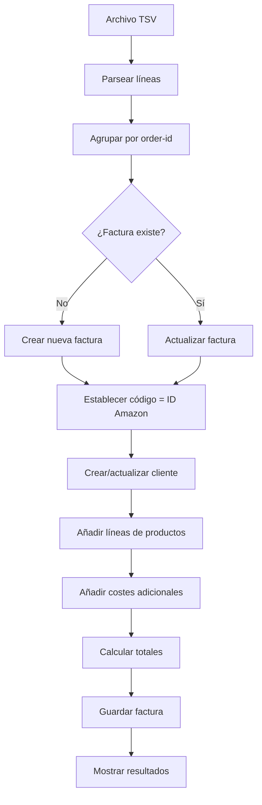

# 📦 AmazonImport Plugin para FacturaScripts

**Importa pedidos de Amazon directamente a FacturaScripts**  
*Convierte reportes TSV de Amazon en facturas de cliente completas*

---

## 🚀 Características Principales

### ✅ **Importación Automática**
- **📄 Formato TSV**: Procesa reportes de ventas de Amazon
- **🔄 Modos de operación**: Crear nuevas facturas o actualizar existentes
- **🎯 Identificación única**: Usa ID de Amazon como código de factura

### ✅ **Gestión Completa de Facturas**
- **👤 Clientes automáticos**: Crea/encuentra clientes por email
- **📦 Productos inteligentes**: Crea productos con SKU de Amazon
- **💰 Cálculos precisos**: IVA, envíos, gift wrap incluidos
- **📅 Fechas secuenciales**: Compatible con validación de FacturaScripts

### ✅ **Interfaz Amigable**
- **📤 Subida fácil**: Drag & drop o botón "Examinar"
- **⚡ Procesamiento rápido**: Múltiples pedidos en un solo archivo
- **📊 Resultados claros**: Estadísticas de importación

---

## 📋 Requisitos del Sistema

| Componente | Versión | Notas |
|------------|---------|-------|
| **FacturaScripts** | 2025.x | Versión estable más reciente |
| **PHP** | 8.1+ | Con extensiones estándar |
| **Base de datos** | MySQL/MariaDB | Tablas estándar de FacturaScripts |

---

## 🛠️ Instalación

### 1. **Descargar plugin**
```bash
# Usar la versión más reciente (v7)
AmazonImport-fixed-v7.zip
```

### 2. **Instalar en FacturaScripts**
1. Extraer `AmazonImport-fixed-v7.zip` en `plugins/` de FacturaScripts
2. Acceder al panel de administración de FacturaScripts
3. Habilitar el plugin **AmazonImport**
4. El plugin aparecerá en el menú principal

### 3. **Configuración inicial**
- ✅ No requiere configuración adicional
- ✅ Los campos obligatorios se establecen automáticamente
- ✅ Los clientes se crean según los datos de Amazon

---

## 📊 Formato del Archivo Amazon

### **Estructura TSV requerida**
El plugin procesa reportes de ventas de Amazon en formato TSV (Tab Separated Values).

**Columnas esenciales:**
```
order-id           # ID único del pedido (403-0931570-5433913)
purchase-date      # Fecha de compra (2025-03-15)
buyer-email        # Email del comprador
buyer-name         # Nombre del comprador
sku                # Código del producto
product-name       # Nombre del producto
quantity           # Cantidad
item-price         # Precio unitario
item-tax           # IVA del producto
shipping-price     # Coste de envío
shipping-tax       # IVA del envío
gift-wrap-price    # Coste de envoltorio regalo
gift-wrap-tax      # IVA del envoltorio
```

### **Ejemplo de datos:**
```tsv
order-id	purchase-date	buyer-email	buyer-name	sku	product-name	quantity	item-price	item-tax
403-0931570-5433913	2025-03-15	cliente@email.com	Juan Pérez	PROD-123	Producto Ejemplo	1	29.99	6.30
```

---

## 🎮 Uso del Plugin

### **Paso 1: Acceder al plugin**
1. Navegar a **AmazonImport** en el menú de FacturaScripts
2. Verás la interfaz de importación

### **Paso 2: Subir archivo**
- **Opción A**: Arrastrar y soltar archivo TSV en el área indicada
- **Opción B**: Hacer clic en **"Examinar"** y seleccionar archivo

### **Paso 3: Seleccionar modo**
| Modo | Descripción | Uso recomendado |
|------|-------------|-----------------|
| **🆕 Crear** | Crea nuevas facturas | Primera importación |
| **🔄 Actualizar** | Actualiza facturas existentes | Re-importar con cambios |

### **Paso 4: Procesar**
1. Hacer clic en **"Procesar Archivo"**
2. Esperar a que termine el procesamiento
3. Ver resultados en pantalla

---

## 🔧 Funcionamiento Interno

### **📋 Flujo de procesamiento**


### **🎯 Código de factura = ID de Amazon**
```php
// Cada factura tiene:
$factura->codigo = "403-0931570-5433913";  // ID de Amazon
$factura->numero = "42";                   // Secuencial automático
$factura->observaciones = "Amazon Order: 403-0931570-5433913";
```

**Ventajas:**
- ✅ Identificación única por pedido
- ✅ Evita duplicados en re-importaciones
- ✅ Búsqueda rápida en FacturaScripts
- ✅ Trazabilidad completa

### **👤 Gestión de clientes**
```php
// El plugin:
1. Busca cliente por email
2. Si no existe → crea nuevo cliente
3. Establece campos obligatorios:
   - nombre / razonsocial
   - cifnif = "VARIOUS"
   - email y teléfono
```

### **💰 Cálculo de totales**
```php
// Usa Calculator de FacturaScripts:
Calculator::calculate($factura, $lineas, true);
// Incluye:
// - Subtotal productos
// - IVA de productos
// - Costes de envío
// - Gift wrap con IVA
```

---

## 🐛 Correcciones Incluidas (v7)

### **✅ Problemas Resueltos**
| # | Problema | Solución |
|---|----------|----------|
| 1 | Campos NULL (cifnif, nombrecliente) | Establece todos los campos obligatorios |
| 2 | Error "Petición no válida" | Tokens CSRF correctos |
| 3 | Botón "Examinar" no funciona | JavaScript corregido |
| 4 | Error "Method getNeto does not exist" | Usa Calculator::calculate() |
| 5 | Error "Fecha no válida" | Fechas secuenciales automáticas |
| 6 | No se identifica pedidos existentes | **ID Amazon como código de factura** |
| 7 | Productos sin IVA visible | Asigna codimpuesto basado en porcentaje de IVA |
| 8 | **IVA 0% cuando Amazon no desglosa impuestos** | **Asume IVA 21% incluido en precio** |

### **📅 Manejo de fechas**
```php
// Para compatibilidad con FacturaScripts:
1. Ordena pedidos por fecha de compra
2. Usa fechas secuenciales
3. Última fecha + 1 minuto para cada factura
4. Mantiene secuencia temporal correcta
```

### **💰 Corrección de IVA (v7)**
```php
// Problema 1: Productos no mostraban IVA correctamente
// Solución: Asigna codimpuesto basado en porcentaje de IVA

1. Busca impuesto por porcentaje (21%, 10%, 4%, 0%)
2. Si no existe, usa código por defecto según porcentaje
3. Asigna codimpuesto a productos y líneas de factura
4. Compatible con Prestashop plugin

// Códigos de impuesto comunes:
- 21% → IVA21
- 10% → IVA10  
- 4% → IVA4
- 0% → IVA0

// Problema 2: Amazon no desglosa IVA (item-tax = 0)
// Solución: Asume IVA 21% incluido en precio

1. Si item-tax > 0: calcular IVA normal
2. Si item-tax = 0: asumir IVA 21% incluido
3. Calcular precio neto: precio_total / 1.21
4. Aplicar a productos, envíos y gift wrap

// Ejemplo:
- Precio Amazon: 121€ (con IVA 21% incluido)
- Precio neto: 100€
- IVA: 21€ (21%)
```

---

## 📊 Resultados de Importación

### **Estadísticas mostradas**
```
✅ Facturas creadas: 15
🔄 Facturas actualizadas: 3
⏭️ Pedidos saltados: 2
📦 Total procesado: 20 pedidos
```

### **Facturas creadas incluyen:**
- ✅ Código único (ID Amazon)
- ✅ Cliente con todos los datos
- ✅ Líneas de productos con IVA **y codimpuesto** correctos (v7)
- ✅ Costes adicionales (envío, gift wrap) con IVA correcto
- ✅ Totales calculados correctamente
- ✅ Fecha secuencial válida
- ✅ **Productos con codimpuesto asignado** (v7)
- ✅ **IVA 21% cuando Amazon no desglosa impuestos** (v7)

---

## 🔍 Búsqueda en FacturaScripts

### **Encontrar facturas de Amazon**
```sql
-- Buscar por código (ID Amazon)
SELECT * FROM facturascli WHERE codigo = '403-0931570-5433913';

-- Buscar todas las facturas de Amazon
SELECT * FROM facturascli WHERE observaciones LIKE 'Amazon Order:%';
```

### **Filtros útiles:**
1. **Por pedido específico**: `codigo = 'ID-AMAZON'`
2. **Todas las de Amazon**: `observaciones LIKE 'Amazon Order:%'`
3. **Por cliente**: `nombrecliente = 'Nombre Cliente'`
4. **Por fecha**: `fecha BETWEEN '2025-03-01' AND '2025-03-31'`

---

## 🚨 Solución de Problemas

### **Problemas comunes y soluciones:**

| Problema | Causa | Solución |
|----------|-------|----------|
| **"Campos no pueden ser NULL"** | Datos de cliente incompletos | v5 incluye corrección automática |
| **"Petición no válida"** | Token CSRF incorrecto | v5 usa tokens correctos |
| **Botón no funciona** | Conflicto JavaScript | v5 tiene eventos corregidos |
| **"Fecha no válida"** | Secuencia incorrecta | v5 ordena por fecha |
| **Duplicados** | Re-importación sin control | v5 usa ID Amazon como código único |
| **Productos sin IVA** | Falta codimpuesto | v6 asigna codimpuesto automáticamente |
| **IVA 0% incorrecto** | Amazon no desglosa impuestos | **v7 asume IVA 21% incluido** |

### **Verificar instalación:**
```bash
# Estructura correcta del plugin:
AmazonImport/
├── Controller/AmazonImport.php
├── Lib/AmazonImportService.php      # ✅ v7 con corrección de IVA incluido
├── View/AmazonImport.html.twig
├── Model/AmazonRow.php              # ✅ v7 con lógica IVA 21% incluido
└── facturascripts.ini
```

---

## 📈 Mejores Prácticas

### **1. Preparación de datos**
- ✅ Exportar reportes completos de Amazon
- ✅ Verificar formato TSV correcto
- ✅ Incluir todas las columnas necesarias

### **2. Proceso de importación**
- ✅ Primera vez: usar modo **"Crear"**
- ✅ Actualizaciones: usar modo **"Actualizar"**
- ✅ Verificar resultados después de cada importación

### **3. Mantenimiento**
- ✅ Backup antes de importaciones grandes
- ✅ Revisar facturas creadas en FacturaScripts
- ✅ Actualizar plugin cuando haya nuevas versiones

---

## 🔄 Actualizaciones del Plugin

### **Versiones disponibles:**
| Versión | Correcciones | Estado |
|---------|--------------|--------|
| v1 | Campos NULL | ⚠️ Obsoleto |
| v2 | + Formulario/Botón | ⚠️ Obsoleto |
| v3 | + Calculator | ⚠️ Obsoleto |
| v4 | + Fechas secuenciales | ✅ Bueno |
| v5 | + ID Amazon como código | ✅ Bueno |
| v6 | + Corrección de IVA (codimpuesto) | ✅ Bueno |
| **v7** | **+ IVA 21% cuando Amazon no desglosa** | **⭐ RECOMENDADO** |

### **Actualizar a v7:**
1. Deshabilitar versión anterior
2. Eliminar carpeta `AmazonImport/` antigua
3. Extraer `AmazonImport-fixed-v7.zip`
4. Habilitar plugin nuevamente

---

## 📞 Soporte y Contacto

### **Documentación adicional:**
- `AmazonImport-CORRECCION-CODIGO.md` - Detalles técnicos v5
- `AmazonImport-RESUMEN-FINAL.md` - Todas las correcciones
- `test_amazon_code.php` - Script de verificación

### **Para problemas:**
1. Verificar que usas **v7** (`AmazonImport-fixed-v7.zip`)
2. Revisar formato del archivo TSV
3. Comprobar logs de FacturaScripts
4. Probar con archivo pequeño primero

---

## 🎉 ¡Listo para usar!

**AmazonImport v7** incluye todas las correcciones necesarias para importar pedidos de Amazon a FacturaScripts de manera confiable y eficiente.

```bash
# Archivo final recomendado:
AmazonImport-fixed-v7.zip

# Contiene 8 correcciones completas:
✅ Campos obligatorios
✅ Tokens CSRF  
✅ Botón funcional
✅ Calculator para totales
✅ Fechas secuenciales
✅ ID Amazon como código único
✅ Corrección de IVA (codimpuesto)
✅ **IVA 21% cuando Amazon no desglosa** - v7
```

**¡Importa tus pedidos de Amazon y gestiona tus facturas automáticamente!** 🚀

---

*Última actualización: 31 de marzo de 2026*  
*Versión: AmazonImport-fixed-v7*  
*Compatibilidad: FacturaScripts 2025.x*